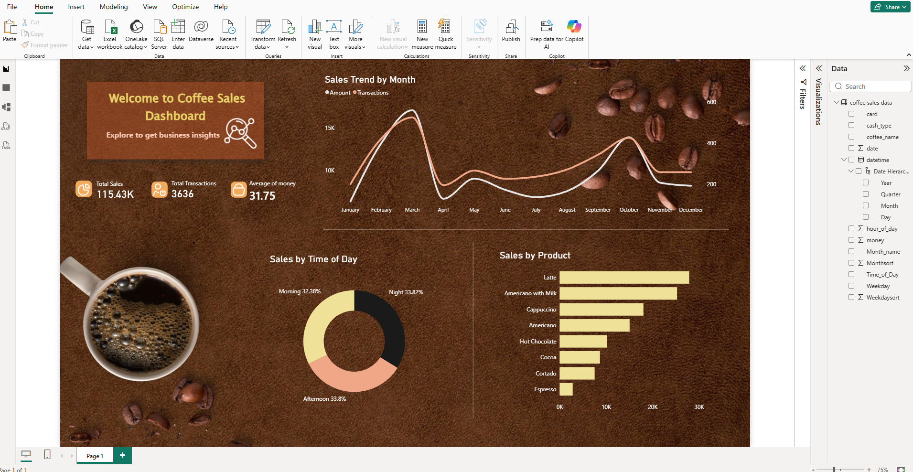

# powerbi-coffee-sales-dashboard
This project showcases an interactive Power BI dashboard built to analyze sales performance and transaction behavior. The dashboard provides a clear view of key business metrics, sales trends, and product-level insights to support data-driven decision-making.

# Power BI Coffee Sales Dashboard
## Objectives
- Monitor overall sales performance using key KPIs
- Identify monthly sales and transaction trends
- Analyze customer purchase behavior by time of day
- Compare product-level sales performance

## Dashboard Preview

## Key Metrics
- Total Sales
- Total Transactions
- Average Transaction Value

## Dashboard Features
- KPI cards for quick performance snapshot
- Monthly sales and transaction trend analysis
- Sales distribution by time of day
- Product-wise sales comparison
- Simple and performance-optimized visual design

## Design Approach
- Focused on clarity, usability, and performance
- Minimal visuals with high business relevance
- Optimized for analytical insights rather than visual complexity

## Files Included
- Power BI dashboard file (.pbix)
- Sample dataset used for analysis
- Dashboard screenshot for quick reference

## Use Case
This dashboard can be adapted for retail, food & beverage, or transaction-based businesses to track sales performance, identify trends, and support operational decisions.
